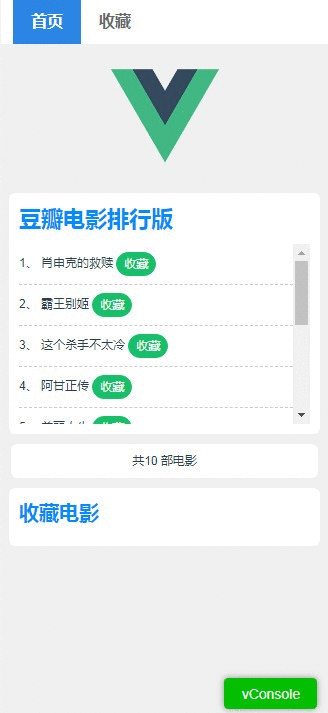

# wangpq-vue-vuex-demo
> 使用Vue-cli脚手架构建的一个简单的Vue单页应用示例，旨在演示。使用到的技术，axios或者jsonp获取ajax数据，vuex管理状态,vue-router管理路由。

## Vue单页应用刷新时数据状态如何保留
 
如何监听刷新事件呢，我们可以通过 beforeunload 来达到目的，然后在 src下App.vue的created 钩子函数里写下了如下代码：

``` bash
# 在页面加载时读取sessionStorage里的状态信息
sessionStorage.getItem("movieCollect") && this.$store.replaceState(JSON.parse(sessionStorage.getItem("movieCollect")));

# 在页面刷新时将vuex里的信息保存到sessionStorage里
window.addEventListener("beforeunload",()=>{
    sessionStorage.setItem("movieCollect",JSON.stringify(this.$store.state))
})
```

使用sessionStorage可以让刷新的时候数据不丢失，如果你想即使页面关闭后再从新打开，数据仍然不消失，请把sessionStorage换成 localStorage。

这种通过beforeunload监听的方案缓存数据比将数据变化在vuex里直接操作storage更新要好，因为不用每次数据变化都更新数据，它只会在打开关闭和刷新页面的时候进行storage操作，而且我们也可以指定使用storage缓存的数据字段，不是所有的数据都需要使用storage缓存。


## 如何运行此示例


``` bash
# npm下载依赖
npm install

# 本地调试运行
npm run dev

# 生产打包
npm run build

# build for production and view the bundle analyzer report
npm run build --report
```

## 运行效果
